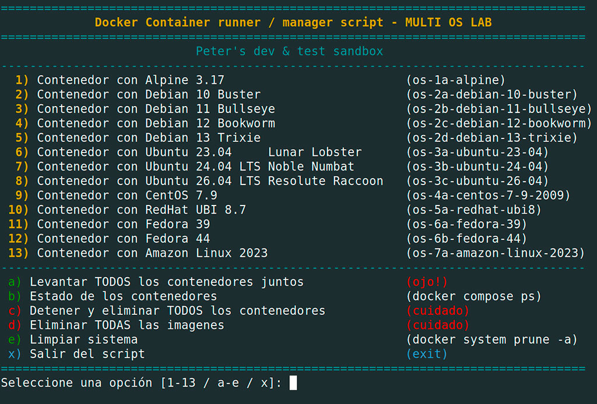

# A-Lab-01 :


Colección de laboratorios y utilidades para practicar administración de sistemas
Linux, scripting con Bash y creación de entornos Docker reproducibles. El
repositorio no es una aplicación única: reúne experimentos independientes para
estudiar herramientas de consola, imágenes base de docker y operación de contenedores.

## Qué problema resuelve

Centraliza ejemplos prácticos para:

### Bash
- consultar y formatear información de usuarios, grupos, disco y servicios;

### Docker
- inspeccionar contenedores, imágenes, volúmenes, redes y estadísticas de Docker;
- levantar varias distribuciones Linux en contenedores aislados pero conectados a
  una red común;
- comparar gestores de paquetes y configuraciones de imágenes basadas en **Alpine,
  Debian, Ubuntu, CentOS, Red Hat, Fedora y Amazon Linux**.

## Tecnologías y herramientas

- **Bash** y utilidades GNU/Unix (`awk`, `sed`, `grep`, `sort`, `du`, `df`,
  `free`, `id`, `column`).
- **Docker Engine**, **Docker Compose** y **Dockerfiles**.
- **Make** para comandos operativos del laboratorio Docker.
- Gestores de paquetes de las imágenes: `apk`, `apt`, `apt-get`, `yum` y `dnf`.
- Herramientas instaladas en las imágenes: `neofetch`, `fastfetch`, `figlet` y `mc`.
- **VS Code** mediante una configuración opcional de iconos y reglas de
  columnas.


## Arquitectura

El proyecto se divide en dos áreas sin una capa de aplicación compartida:

1. **Utilidades Bash en el anfitrión**: scripts ejecutables que leen información
   del sistema local o del daemon de Docker y presentan resultados en consola.
2. **Laboratorio Docker**: cada Dockerfile parte de una distribución Linux,
   instala herramientas de consola, copia un entrypoint y deja el contenedor
   activo mediante `sleep infinity`. `docker-compose.yaml` construye los ocho
   servicios y los conecta a la red `os-linux-hub`.

Los Dockerfiles usan `ARG IMAGE_NAME`, por lo que la imagen base puede
reemplazarse al construir desde línea de comandos. Las imágenes y los
contenedores se identifican con nombres y etiquetas definidos en Compose.


## Funcionalidades principales

### Scripting Linux bash:

* `clean-disk.sh`: script de mantenimiento y limpieza del sistema raíz en Ubuntu que calcula el espacio antes y después del proceso, actualizando e inspeccionando paquetes de `apt` (limpieza de caché y huérfanos), vaciando la papelera y miniaturas de usuario, liberando logs de `systemd` y eliminando archivos comprimidos o antiguos en `/var/log`.
* `disk-space.sh`: script sencillo que analiza y muestra el uso de espacio en disco del directorio actual hasta una profundidad de 1 nivel, listando los 10 elementos que más espacio ocupan ordenados de forma descendente .
* `go-container.sh`: Detecta los contenedores Docker en ejecución y permite al usuario seleccionar uno mediante un menú numerado para acceder interactivamente a su terminal shell (intentando primero `/bin/bash` y cayendo a `/bin/sh` si no está disponible).
* `go-container-old.sh`: script legacy para acceder de forma rápida por parámetro o selección directa (1, 2, 3 u 9) a la consola interactiva (`/bin/bash`) de contenedores predefinidos estáticamente (`01-nginx`, `02-php`, `03-mariadb` o `09-gulp`), verificando previa ejecución si se encuentran activos.
* `ls-colors.sh`: script utilitario que define y muestra en pantalla una muestra visual de la paleta de variables de colores **ANSI** (normales y en negrita) empleadas para formatear y dar estilo a la salida de otros scripts Bash.
* `ls-docker.sh`: panel de monitoreo y diagnóstico completo de **Docker** en consola que reporta el tiempo de actividad del sistema, consumo de CPU/Memoria/Disco, estado y estadísticas en tiempo real de contenedores (activos y detenidos), imágenes almacenadas, direccionamiento IP por red, así como detalle de volúmenes e infraestructura de redes creadas.
* `ls-users.sh`: menú interactivo para listar usuarios y grupos a partir de `/etc/passwd` y `/etc/group`, ordenados por UID/GID o nombre, incluyendo los grupos asociados a cada usuario.
* `ls-volumes.sh`: script de inspección detallada que requiere privilegios elevados (`sudo`) para listar todos los volúmenes de **Docker**, mostrando su nombre, controlador, proyecto asociado, contenedor conectado, punto de montaje e identificando el tamaño real en megabytes (MB) que ocupa cada volumen en el disco.
* `ssh timeout.txt`: fragmento de configuración para `/etc/ssh/ssh_config` que establece la directiva `ServerAliveInterval 60`, la cual envía paquetes de mantenimiento de conexión cada 60 segundos para evitar desconexiones por inactividad en sesiones SSH.
* `status.sh`: script de diagnóstico rápido del entorno web local que imprime el estado de los servicios `apache2` y `mysql`, junto con las versiones instaladas de `php`, `node.js` y `npm`.


## Entornos Docker:

Compose define estos servicios:

| Servicio | Imagen base |
| --- | --- |
| `os-1a-alpine` | Alpine 3.17 |
| `os-2a-debian-10-buster` | Debian 10 Buster |
| `os-2b-debian-11-bullseye` | Debian 11 Bullseye |
| `os-2c-debian-12-bookworm` | Debian 12 Bookworm |
| `os-2d-debian-13-trixie` | Debian 13 Trixie |
| `os-3a-ubuntu-23-04` | Ubuntu 23.04 Lunar Lobster |
| `os-3b-ubuntu-24-04` | Ubuntu 24.04 LTS Noble Numbat |
| `os-3c-ubuntu-26-04` | Ubuntu 26.04 LTS Resolute Raccoon |
| `os-4a-centos-7-9-2009` | CentOS 7.9 |
| `os-5a-redhat-ubi8` | RedHat UBI 8.7 |
| `os-6a-fedora-39` | Fedora 39 |
| `os-6b-fedora-44` | Fedora 44 |
| `os-7a-amazon-linux-2023` | Amazon Linux 2023 |

Los entrypoints muestran información de la distribución
(`neofetch` , `fastfetch` y `figlet` segun la imagen) y mantienen el proceso 
en ejecución para permitir acceso interactivo.

## Requisitos

- Docker Engine y Docker Compose v2 (`docker compose`).
- Bash para ejecutar los scripts.
- `sudo` para `ls-volumes.sh`.
- Un daemon Docker accesible para los scripts que inspeccionan Docker.


### Levantar el laboratorio Docker

```bash
cd docker-labs
docker compose up -d --build
docker compose ps
```

Para abrir una shell en un contenedor:

```bash
docker exec -it 2b-debian-11-bullseye bash
docker exec -it 1a-alpine-3.17 sh
```

Alpine se accede con `sh`; las demás imágenes están configuradas con
`/bin/bash` como comando predeterminado, siempre que esa shell exista en la
imagen.


También se pueden consultar recursos con `make show_me_all`.
`make delete_all` elimina de forma forzada los contenedores e imágenes con los 
nombres definidos por el proyecto; úsalo únicamente si se desea esa limpieza.

### Ejecutar las utilidades Bash

Desde la raíz del repositorio:

```bash
bash bash-scripting/clean-disk.sh
bash bash-scripting/disk-space.sh
bash bash-scripting/ls-colors.sh
bash bash-scripting/ls-users.sh
bash bash-scripting/ls-docker.sh
sudo bash bash-scripting/ls-volumes.sh
bash bash-scripting/status.sh
```

`ls-users.sh` solicita una opción por teclado. 
`ls-docker.sh` y `ls-volumes.sh` requieren que Docker esté instalado y accesible. 
`status.sh` invoca `service apache2`, `php`, `service mysql`, `node` y `npm`; si alguno no
está instalado o configurado como servicio, su salida reflejará esa situación.

El fragmento SSH puede incorporarse manualmente a la configuración global
`/etc/ssh/ssh_config`, revisando antes el impacto de aplicar
`ServerAliveInterval 60` a todas las conexiones del equipo.

## Estructura relevante

```text
.
├── bash-scripting/
│   ├── clean-disk.sh
│   ├── disk-space.sh
│   ├── ls-colors.sh
│   ├── ls-docker.sh
│   ├── ls-users.sh
│   ├── ls-volumes.sh
│   ├── status.sh
│   └── ssh timeout.txt
│
├── docker-labs/
│   ├── Dockerfile.1a-alpine-3.17
│   ├── Dockerfile.2a-debian-10-buster
│   ├── Dockerfile.2b-debian-11-bullseye
│   ├── Dockerfile.2c-debian-12-bookworm
│   ├── Dockerfile.2d-debian-13-trixie
│   ├── Dockerfile.3a-ubuntu-23.04
│   ├── Dockerfile.3b-ubuntu-24.04
│   ├── Dockerfile.3c-ubuntu-26.04
│   ├── Dockerfile.4a-centos-7.9.2009
│   ├── Dockerfile.5a-redhat-ubi8
│   ├── Dockerfile.6a-fedora-39
│   ├── Dockerfile.6b-fedora-44
│   ├── Dockerfile.7a-amazon-linux-2023
│   ├── docker-compose.yaml
│   ├── entrypoint.01.sh
│   ├── entrypoint.02.sh
│   ├── docker-menu.sh
│   └── Makefile
│
└── .vscode/settings.json
```


## Dockerfiles por sistema operativo

- `Dockerfile.1a-alpine-3.17`: imagen basada en **Alpine Linux 3.17**.
- `Dockerfile.2a-debian-10-buster`: imagen basada en **Debian 10 Buster**.
- `Dockerfile.2b-debian-11-bullseye`: imagen basada en **Debian 11 Bullseye**.
- `Dockerfile.2c-debian-12-bookworm`: imagen basada en **Debian 12 Bookworm**.
- `Dockerfile.2d-debian-13-trixie`: imagen basada en **Debian 13 Trixie**.
- `Dockerfile.3a-ubuntu-23.04`: imagen basada en **Ubuntu 23.04 Lunar Lobster**.
- `Dockerfile.3b-ubuntu-24.04`: imagen basada en **Ubuntu 24.04 LTS Noble Numbat**.
- `Dockerfile.3c-ubuntu-26.04`: imagen basada en **Ubuntu 26.04 LTS Resolute Raccoon**.
- `Dockerfile.4a-centos-7.9.2009`: imagen basada en **CentOS 7.9**.
- `Dockerfile.5a-redhat-ubi8`: imagen basada en **Red Hat Universal Base Image 8.7**.
- `Dockerfile.6a-fedora-39`: imagen basada en **Fedora 39**.
- `Dockerfile.6b-fedora-44`: imagen basada en **Fedora 44**.
- `Dockerfile.7a-amazon-linux-2023`: imagen basada en **Amazon Linux 2023**.

## Archivos de soporte

- `docker-compose.yaml`: define los servicios, sus imágenes, sus
  Dockerfiles y la red compartida `os-linux-hub`.
- `entrypoint.01.sh`: entrypoint utilizado por Alpine, Debian y Ubuntu.
- `entrypoint.02.sh`: entrypoint utilizado por CentOS, Red Hat UBI y Fedora.
- `docker-menu.sh`: ejecuta un script interactivo ( ver imagen )
- `Makefile`: proporciona comandos para consultar y eliminar recursos Docker.


## Script "docker-menu.sh"
Al ejecutar el script Bash `./docker-menu.sh`, accederás a un menú interactivo
que te permitirá crear contenedores Docker utilizando diferentes sistemas operativos ( Linux).

<p align="center">
  
</p>


## Decisiones técnicas relevantes

- Se mantienen Dockerfiles separados para hacer visible la diferencia entre
  distribuciones y sus gestores de paquetes.
- Los `entrypoint` son deliberadamente simples y mantienen los contenedores
  vivos para facilitar prácticas con `docker exec`.
- Compose concentra la construcción y asigna una red común, en lugar de
  configurar cada contenedor manualmente.
- Los scripts formatean la salida con colores ANSI y tablas para facilitar la
  inspección desde una terminal.
- No se incorporan dependencias de una aplicación ni automatización de
  despliegue: **el objetivo es de estudio y pruebas**.


## Estado del proyecto

**Repositorio de prácticas y experimentación** .


## Autor :
**Pedro Javier Acosta**
- GitHub: 	[github.com/peteracosta](https://github.com/peteracosta)
- LinkedIn: [linkedin.com/in/acosta-peter](https://linkedin.com/in/acosta-peter)
